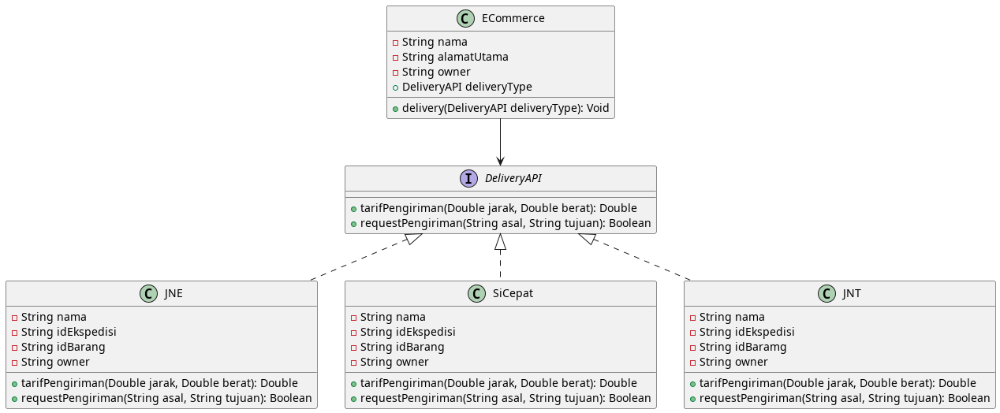

# Penjelasan UML Diagram
File [uml-diagram-kel-2.puml](https://github.com/andrisan-ub/pbpu-a-2022/blob/2-uml-kelompok-2/Kelompok%202/uml-diagram-kel-2.puml) berisi *source code* UML Diagram yang ditulis dalam syntax **PlantUML**. Berikut tampilan UML Diagramnya:

## Penjelasan Komponen Pada Setiap Class Diagram

### ECommerce
Ecommerce merupakan sebuah **class** yang memiliki atribut bersifat private yaitu nama, alamatUtama, owner, dan DeliveryAPI
Clas Ecommerce juga memiliki sebuah method yang bersifat public, method tersebut adalah :
1. **delivery(DeliveryAPI deliveryType)**. Method delivery() menerima 1 parameter, yaitu **deliveryType** yang memiliki tipe data DeliveryAPI. Method ini digunakan untuk menentukan jenis jasa/kurir yang akan digunakan dimana setiap jasa pengiriman merupakan bagian dari DeliveryAPI

### DeliveryAPI
DeliveryAPI merupakan sebuah **Interface** yang memiliki dua buah method yang bersifat *public*. Kedua method tersebut yaitu:
1. **tarifPengiriman(Double jarak, Double berat)**. Method tarifPengiriman() menerima dua parameter yaitu **jarak** dan **berat** yang sama-sama bertipe data Double yang digunakan untuk melakukan perhitungan tarif pengiriman barang. Method tarifPengiriman() akan mereturn perhitungan tarif pengiriman bertipe data Double.
2. **requestPengiriman(String asal, String tujuan)**. Method requestPengiriman() menerima dua parameter yaitu **asal** dan **tujuan** yang sama-sama bertipe data String yang digunakan untuk menerima request pengiriman yang dilakukan oleh pengirim. Method requestPengiriman() akan mereturn Boolean yang akan bertipe *true* apabila parameter method bersifat valid dan akan mereturn *false* apabila parameter method tidak valid.

### JNE
JNE adalah sebuah class dengan atribut private nama, idEkspedisi, idBarang, owner. serta mengimplementasi method dari interface DeliveryAPI yaitu :
1. **tarifPengiriman(Double jarak, Double berat)**
2. **requestPengiriman(String asal, String tujuan)**

### JNT
JNT adalah sebuah class dengan atribut private nama, idEkspedisi, idBarang, owner. serta mengimplementasi method dari interface DeliveryAPI yaitu :
1. **tarifPengiriman(Double jarak, Double berat)**
2. **requestPengiriman(String asal, String tujuan)**

### SiCepat
SiCepat adalah sebuah class dengan atribut private nama, idEkspedisi, idBarang, owner. serta mengimplementasi method dari interface DeliveryAPI yaitu :
1. **tarifPengiriman(Double jarak, Double berat)**
2. **requestPengiriman(String asal, String tujuan)**

## Penjelasan Relasi Antar Class

### Class E-commerce dengan Interface DeliveryAPI
Hubungan class E-commerce dengan Interface DeliveryAPI adalah class asosiasi, dimana class E-commerce dapat berinteraksi dengan class-class ekspedisi menggunakan method **delivery()** namun hanya dengan ekspedisi yang telah mengimplementasi Interface DeliveryAPI, sehingga asosiasi dilakukan melalui perantara interface DeliveryAPI.

### Class JNE, SiCepat, dan JNT dengan Interface DeliveryAPI
Hubungan dari ketiga kelas JNE, SiCepat, dan JNT sebagai penyedia layanan ekspedisi adalah mengimplementasikan Interface DeliveryAPI dalam class tersebut, hal ini berarti setiap class tersebut harus menerapkan method yang ada di dalam Interface DeliveryAPI.
