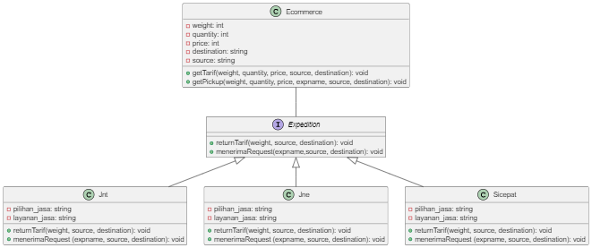

# Pengembangan Berorientasi Penggunaan Ulang (PBPU)
## Definisi UML Diagram
UML Diagram merupakan diagram yang digunakan sebagai representasi visual objek, kondisi, dan proses yang terjadi di dalam sebuah sistem.

## Komponen-Komponen UML Diagram
### 1. Ecommerce
Ecommerce merupakan sebuah class yang terdiri dari atribut weight(int), quantity(int), price(int), destination(string), dan source(int). Seluruh atribut ini bersifat private. Class ini juga memiliki 2 buah method, yaitu :

a) getTarif(weight, quantity, price, source, destination)
Method ini bersifat void dan public, serta memiliki 5 parameter, yaitu weight, quantity, price, source, destination. Method ini akan dipanggil di main class untuk mendapatkan data tarif yang akan dikenakan kepada customer/pelanggan setelah memesan layanan jasa kurir. 

b) getPickup(weight, quantity, price, expname, source, destination)
Method ini juga bersifat void dan public, serta memiliki 6 parameter, yaitu weight dengan tipe data int, quantity dengan tipe data int, price dengan tipe data int, expname dengan tipe data string, source dengan tipe data string, destination. Method ini berfungsi untuk mendapatkan data salah satu jenis ekspedisi yang diinginkan (di antara Jnt, Jne, dan Sicepat).

### 2. Expedition
Expedition merupakan sebuah interface yang memiliki 2 abstract method. Interface sendiri memungkinkan berbagai konstanta ataupun method yang dapat digunakan oleh sejumlah kelas. Kedua method ini nantinya akan digunakan di masing-masing jenis ekspedisi. Kedua method tersebut terdiri dari :

a) returnTarif(int weight, string source, string destination)
Method ini ini memiliki 3 parameter yang berfungsi untuk mereturn tarif pengiriman sesuai jenis masing-masing class.

b) menerimaRequest(string expname, string source, string destination)
Method ini memiliki 3 parameter yang berfungsi untuk mereturn jenis ekspedisi yang digunakan.

### 3. Jnt
Class Jnt berisi 2 atribut dengan sifat private, yaitu pilihan_jasa dan layanan_jasa dengan tipe data string. Selain itu, class ini memiliki 2 method yang diimplementasikan dari interface Expedition, antara lain :

a) returnTarif(weight, source, destination)

b) menerimaRequest(expname, source, destination)

### 4. Jne
Class Jne berisi 2 atribut dengan sifat private, yaitu pilihan_jasa dan layanan_jasa dengan tipe data string. Selain itu, class ini memiliki 2 method yang diimplementasikan dari interface Expedition, antara lain :

a) returnTarif(weight, source, destination)

b) menerimaRequest(expname, source, destination)

### 5. Sicepat
Class Sicepat berisi 2 atribut dengan sifat private, yaitu pilihan_jasa dan layanan_jasa dengan tipe data string. Selain itu, class ini memiliki 2 method yang diimplementasikan dari interface Expedition, antara lain :

a) returnTarif(weight, source, destination)

b) menerimaRequest(expname, source, destination)

